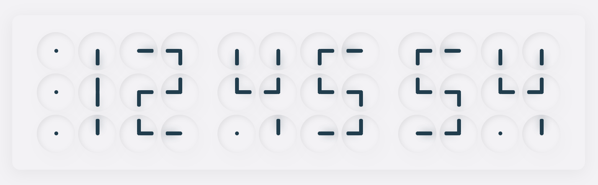

### ClockClock Web implementation
Inspired by [ClockClock](https://clockclock.com/) project  
Vue.js is used as a framework 
[[Demo]](https://andymarch25.github.io/clock-clock/)



##### Project setup
```
npm install
```

##### Compiles and hot-reloads for development
```
npm run serve
```

#### Update GitHub Pages (Demo)
##### 1. Build
```
npm run build
```
##### 2. Commit changes
```
git add dist && git commit -m 'commit message'
```
##### 3. Push changes
```
git subtree push --prefix dist origin gh-pages
```